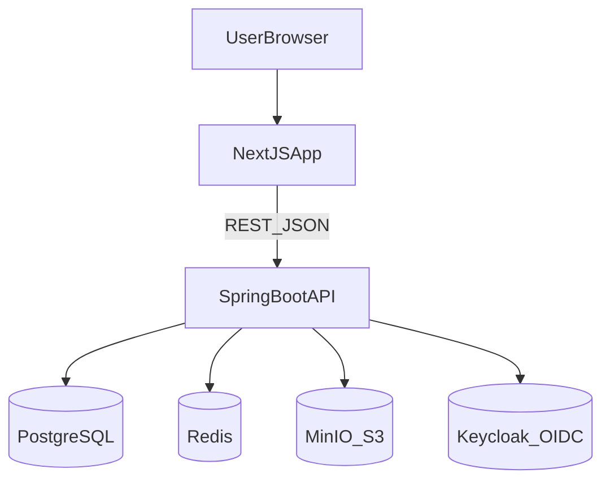

# FuelEUTower

Single source of truth for **FuelEU Control Tower**: product progress, versioning, engineering process, architecture notes, capstone deliverables, demo runbook, and submission QA.

---

## How to use this document

- **Progress and versions**: See [Version ladder](#version-ladder-progress-only).
- **Capstone evaluation**: Rubric mapping, report narrative, evidence, presentation, Q&A, and QA checklist are all below—no separate capstone `.md` files.
- **Day-to-day engineering**: [Engineering process](#engineering-process) and [Local runtime](#local-runtime-frontend-backend-database).

Agent orchestration rules: `AGENTS.md`. Domain glossary and non-negotiable constraints (also loaded as Cursor rules): `.cursor/rules/fueleu-domain.mdc`. For behavioral version notes on major changes, update the [Version ladder](#version-ladder-progress-only) in this file (see `.cursor/rules/git-push-policy.mdc`).

### Repository layout (samples and tooling)

| Path | Purpose |
|------|---------|
| `fixtures/xml/` | Committed DNV-style XML samples for import demos and manual testing. |
| `tools/regulatory/` | Regulatory `params.json` snapshot, `excel_schema.json`, and optional Python scripts to regenerate from a local workbook. |

---

## Version ladder (progress only)

Milestones are ordered from earliest foundation to current integration. Each step builds on the previous.

| Version | Progress milestone |
|--------|---------------------|
| **v0.9.0** | Fleet Registry integration: schema migration, controller bindings, Next.js registration with `buildYear` and `flagState`. |
| **v0.9.5** | Core flexibility workflows: banking and borrowing wired from Next.js to Java backend with isolated persistence. |
| **v1.0.0** | XML data pipeline: multipart upload from Next.js, Jackson parsing, MJ boundaries persisted in SQL. |
| **v1.0.1** | Policy hardening: eligibility checks (borrow cap, mutual exclusivity pool/borrow, one pool per ship-year, banking lockouts, no consecutive borrowing), structured API conflicts, `audit_event` correlation; full-page FE sweep (dashboard, fleet, flexibility, ledger, import, doc-tracker, settings). |
| **v1.0.2** | Unit and demo hardening: DNV-aligned unit consistency across FE/BE/OpenAPI (`gCO2eq`, `gCO2eq/MJ`, `MJ`, `EUR`, marketplace `1 CB = 1 tCO2eq`), ledger-driven dashboard flexibility figures, `npm run start:clean` for deterministic production demos (avoids stale Next.js chunks). |
| **v1.0.3** (documentation) | Single-document consolidation: all capstone and architecture narrative merged into this `FuelEUTower.md`; redundant markdown removed from `docs/`. |
| **v1.0.4** (repository layout) | Docs/rules cleanup: `CLAUDE.md` removed; domain rules in `.cursor/rules/fueleu-domain.mdc`; demo XML and regulatory tooling under `fixtures/xml/` and `tools/regulatory/`; `Study Material/` dropped from tracked layout (ignore local leftovers if a workbook is still open). |
| **v1.0.5** (documentation sync) | `FuelEUTower.md` updated with a full [implemented-feature inventory](#implemented-feature-inventory-synced-with-repository) matching the repo; `.claude/` excluded from version control via `.gitignore`; release commit bundles documentation, fixtures, tools, and rule files. |

**Current label**: `v1.0.5-docs` (product core remains `v1.0.2-MVP` until next functional release).

### Delivered technical components (summary)

- Domain modeling and PostgreSQL schemas (Flyway `V1`–`V5`).
- Infra scaffolding: Docker Compose (Postgres, Redis, MinIO, Keycloak).
- Compliance calculation and DNV-oriented methodology in backend.
- Executive dashboard with ledger-backed KPIs.
- Fleet registry (CRUD UI + API).
- Flexibility: banking, borrowing, pooling (including pool lifecycle: allocations, cancel, delete where allowed).
- Imports: XML and XLSX paths; ledger override ingestion from Excel where implemented.
- Marketplace CB quote/purchase path with unit conversion guardrails.
- Compliance ledger UI with edit API and import linkage.
- Integration/unit tests for critical paths (see `apps/api/src/test`).

### Implemented feature inventory (synced with repository)

**Backend (`apps/api`)**

- Spring Boot API on port `8082`; Flyway migrations `V1`–`V5` (including marketplace tables `V4`, compliance ledger override `V5`).
- **Compliance ledger**: `GET` rows merged from override table, calculation, and fallbacks; `PUT` rows persists test overrides and related calculation/bank-borrow consistency; target intensity aligned with DNV reference where configured.
- **Flexibility**: execute bank/borrow/pool; eligibility includes marketplace-purchased CB in effective balance; pool list with participants and allocations; `POST` allocations, `DELETE` participant, `POST` cancel, `DELETE` pool (draft/cancelled); guardrails (one pool per vessel-year, borrow vs pool exclusivity, caps, net balance).
- **Strategy**: `GET` recommendations (penalty vs buy vs borrow style advisory).
- **Marketplace**: CB rate and purchase; `1 CB = 1 tCO2eq` conversion in gCO2eq; OPX-biased and bounded fallbacks per configuration.
- **Ingestion**: XML upload; XLSX parses ledger override columns and applies to `compliance_ledger_override`.
- **OpenAPI**: contract maintained in `packages/openapi/api-spec.yaml` for new endpoints and unit descriptions.
- **Tests**: `spring-boot-starter-test` and integration/unit coverage for flexibility/marketplace/pooling and Excel import parsing.

**Frontend (`apps/web`)**

- Next.js App Router; API base `NEXT_PUBLIC_API_BASE_URL` or default `localhost:8082`.
- **Resilient data loading**: `src/lib/http.ts` (`fetchJson`, `asArray`) with `no-store` and strict `res.ok` so dashboard, ledger, fleet, flexibility, and doc-tracker do not silently render empty on shape or cache quirks.
- **Pages**: executive dashboard (ledger-linked KPIs and trajectories); fleet registry; compliance ledger with edit modal and CSV export; flexibility (multi-vessel pool builder, strategy chips, marketplace buy); doc tracker; import center; settings baseline.
- **Units**: `src/lib/units.ts` centralizes DNV target intensity and display unit labels.
- **Demo stability**: `npm run start:clean` kills stale process, clears `.next`, rebuilds, starts production mode.

**Repository and governance**

- **Single narrative doc**: this file replaces scattered `docs/capstone-*.md`, `docs/architecture/*.md`, `CAPSTONE_PROGRESS.md`, and `CLAUDE.md` for project storytelling.
- **Rules**: `AGENTS.md` (orchestration); `.cursor/rules/fueleu-domain.mdc` (domain + constraints); `.cursor/rules/git-push-policy.mdc` (push + version ladder updates in this file).
- **Samples**: `fixtures/xml/*.xml` for import demos; `tools/regulatory/` for `params.json`, schema snapshot, and regeneration scripts.
- **Ignores**: `.gitignore` includes `Study Material/` (legacy folder) and `.claude/` (local worktrees).
- **Removed boilerplate**: root `CLAUDE.md`, `apps/api/HELP.md`; capstone/architecture markdown trees under `docs/` (content merged here earlier).

### Remaining (next progress steps)

1. **Production-grade policy depth**: cross-vessel pool balancing rules, stricter multi-year borrow/repay ledger, any gaps vs. full regulatory annex.
2. **Production security**: Keycloak/OIDC enforcement, RBAC per matrix below, tenant scoping.
3. **Audit depth**: full correlation of `AuditEvent` for every mutating flexibility/import action.
4. **Capstone delivery polish**: rehearse presentation and demo; run institutional plagiarism/AI checks on prose exported from this document.

---

## Engineering process

- **API contract**: `packages/openapi/api-spec.yaml` is the source of truth; implement server and client against it.
- **Schema**: Flyway scripts in `apps/api/src/main/resources/db/migration` only—no ad-hoc schema drift.
- **Compliance math**: binding calculations live in the backend; Next.js must not compute regulatory balances in UI event handlers.
- **Rule versioning**: borrowing multipliers and caps must tie to `RegulatoryParameter` (or equivalent) per reporting period—not a single hardcoded global.
- **Modular monolith**: bounded contexts in Spring; cross-context via application services or approved integration patterns (`AGENTS.md`).
- **Testing**: changes to calculations, borrowing, or pooling should include or update tests (JUnit; Testcontainers where applicable).

---

## Developer guidelines and domain glossary

Use this section for human-readable context; `.cursor/rules/fueleu-domain.mdc` mirrors the constraints for automation.

**Glossary**

- **ICB:** Initial Compliance Balance — pre-flexibility trajectory distance vs. the GHG limit.
- **ACB:** Adjusted Compliance Balance — ICB adjusted for carry-forward and compliance bounds.
- **VCB:** Verified Compliance Balance — locked, regulator-approved value.
- **GHG limit:** Applicable intensity trajectory for the reporting year.
- **DoC:** Document of Compliance — operational readiness milestone tracked in-app.

**Non-negotiables**

1. **No UI-side binding math:** The calculation engine owns legally material numbers; the UI displays API payloads (light UX validation only).
2. **Audit before comfort:** Banking, borrowing, and pooling mutations must emit correlated audit records per project standards.
3. **Rule versioning:** Do not hardcode repayment multipliers globally; bind them to the active regulatory parameter set for the reporting period.

**Tooling:** TypeScript, Next.js (App Router), Tailwind, shadcn-style components; Java 21, Spring Boot, PostgreSQL, Flyway.

---

## Local runtime (frontend, backend, database)

| Layer | Role | Typical URL / port |
|-------|------|----------------------|
| Frontend | Next.js 14 (App Router), `apps/web` | `http://localhost:3000` |
| Backend | Spring Boot, `apps/api` | `http://localhost:8082` (see `application.yml`) |
| PostgreSQL | Docker Compose service | Host `localhost:5438` → container `5432` |

**Frontend env**: `NEXT_PUBLIC_API_BASE_URL` defaults to `http://localhost:8082` in `apps/web/src/lib/api.ts`.

**Start sequence (typical)**:

1. `docker compose -f infra/docker/docker-compose.yml up -d`
2. Backend: `apps/api/gradlew.bat -p apps/api bootRun` (Java 21)
3. Frontend: `cd apps/web` then `npm run start:clean` (recommended for demos)

**Database persistence**: Postgres data lives in the named Docker volume `postgres_data` (`infra/docker/docker-compose.yml`). Schema is applied by Flyway on API startup (`spring.flyway.enabled: true`). Hibernate DDL is `validate`, not `create-drop`.

**Note**: Compose sets `POSTGRES_DB=fueleu_db` while `application.yml` may target database name `fueleu_app`—align these in ops if you create a fresh database.

---

## Architecture (condensed)

**Pattern**: Modular monolith—synchronous API, room for async/outbox later for heavy jobs.

**Tenets**: contract-first OpenAPI, REST-first resources, idempotency for mutating endpoints where mass operations matter, symmetric validation (Bean Validation on API; UI validates UX only).

**Stack**: Next.js, TypeScript, Tailwind; Java 21, Spring Boot, Spring Data JPA, Flyway; PostgreSQL 16.

---

## Product requirements (PRD summary)

**Goals**: ingest Excel/CSV/XML; compute FuelEU balances correctly; enforce banking, borrowing, pooling; track workflow and DoC readiness; support commercial pooling decisions and exports; maintain auditability.

**Core rules (intent)**:

- Banking: only with positive surplus context; blocked post-DoC where policy applies.
- Borrowing: only in deficit; capped at 2% × applicable limit × in-scope energy; repayment at 1.10× next period; no consecutive borrow years.
- Pooling: one pool per ship per reporting period; net pool balance must remain valid; must not worsen deficit illegitimately; borrow and pool mutually exclusive for same vessel-year.
- Overrides: require reason and audit trail.

---

## Domain model (condensed)

**Reference**: `Vessel`, `Company`, `ReportingPeriod`.

**Compliance**: `VesselYear` (aggregate per ship-year), `FuelEUInput`, `ComplianceCalculation` (ICB/ACB/VCB-aligned fields).

**Flexibility**: `BankingRecord`, `BorrowingRecord`, `Pool`, `PoolParticipant`, `PoolAllocation`.

**Workflow / audit**: `ValidationException`, `WorkflowMilestone`, `AuditEvent` (append-only in target design).

**Hard constraints (target)** unique pool assignment per vessel-year; mutual exclusion borrow vs pool; immutable audit trail.

---

## Import mapping (condensed)

- Legacy Excel: vessel master → Registry; consumption → ingestion / `FuelEUInput` style shapes.
- XML: deterministic parsing; nodes map to port/voyage/fuel references; batches may be `DRAFT` until commit with `AuditEvent`.

---

## RBAC matrix (condensed)

Roles (OIDC/Keycloak-oriented): System Admin; Compliance Manager; Analyst; Commercial Pooling Manager; Verifier Liaison; Read Only Executive; Auditor. See enforcement roadmap in production hardening.

---

# Capstone bundle (single-project)

## Scope statement

**Title**: FuelEU Control Tower — decision and compliance platform for pooling, banking, and borrowing.

**Problem**: Operators lack reliable, auditable, timely support for vessel-level flexibility under FuelEU; spreadsheets amplify error, delay, and penalty exposure.

**Objective**: Design, implement, and evaluate an integrated control tower that turns regulatory inputs into policy-safe actions with backend-owned math and traceable records.

**Research questions**

1. Can a modular full-stack platform improve compliance decision quality vs. spreadsheet workflows?
2. Do embedded guardrails reduce invalid flexibility operations?
3. Can the system support measurable impact (penalty exposure, cycle time)?

**Scope boundaries**

- In: registry, ingestion, ledger, flexibility, dashboard, DoC surfaces, unit-consistent FE/BE.
- Out: full enterprise multi-tenant production, external verifier APIs (unless extended later).

**Cross-functional lens**: operations (cycle time, reliability), finance (penalties, ROI), sustainability (GHG intensity), analytics (scenarios), strategy/policy (roadmap).

---

## Rubric-to-evidence matrix

| Rubric area | Weight | Required evidence | Where in this document |
|-------------|-------:|-------------------|-------------------------|
| Problem identification | 10 | Objectives, scope, justification | [Scope statement](#scope-statement); [Report §1–2](#1-problem-identification-and-definition) |
| Analysis and rigor | 30 | Method, tools, cross-functional logic | [Engineering process](#engineering-process); [Report §3–5](#3-methodology-and-research-design); Architecture and domain sections |
| Effectiveness and implementability | 20 | Feasibility, measurable outcomes | [Evidence pack](#quantified-analysis-and-evidence-pack); [Report §5–6](#5-results-and-findings) |
| Report quality | 20 | Structure, visuals, references | Full report + [References](#references-submission-draft) |
| Presentation and Q&A | 20 | Delivery and panel readiness | [Presentation blueprint](#presentation-blueprint-15-20-slides); [Q&A bank](#capstone-qa-bank); [Demo script](#live-demo-script) |

---

## Abstract

This capstone addresses maritime compliance under FuelEU: operators need fast, auditable, financially sound decisions across vessel-year balances. The project delivers FuelEU Control Tower—a full-stack platform integrating ingestion, compliance ledgering, and flexibility (banking, borrowing, pooling). The MVP demonstrates technical validity, policy-aware controls, and scenario-based managerial framing. Indexed scenario results suggest lower expected penalty exposure and faster cycles vs. spreadsheet baselines, while regulatory integrity is protected by backend-owned calculations and deterministic persistence.

---

## Executive summary

FuelEU Maritime imposes binding GHG intensity limits on energy used on EU-linked voyages. Spreadsheet-centric operations are slow, error-prone, and weakly auditable at fleet scale.

The **FuelEU Control Tower** unifies fleet master data, data ingestion (XML/XLSX), compliance ledger and KPI views, and flexibility mechanisms under API and schema discipline. The contribution is both a **working artifact** and a **managerial framework** to operationalize regulation with traceability.

---

## 1. Problem identification and definition

### 1.1 Business problem

- Many vessel-years and deadlines
- Manual reconciliation across teams
- Unit and interpretation drift
- Late flexibility decisions increasing penalty exposure

### 1.2 Research objective

Improve compliance decision quality, reliability, and financial outcomes under FuelEU constraints.

### 1.3 Stakeholders

Compliance Manager; Commercial Pooling Manager; Verifier Liaison; Executive Sponsor / CFO.

---

## 2. Regulatory and conceptual context

Modeled balances: **ICB**, **ACB**, **VCB**.

Represented constraints include: borrow cap (2% rule); repayment factor 1.10; no consecutive borrowing; pool positivity and deficit non-worsening; penalty conversion for financial narrative.

---

## 3. Methodology and research design

**Approach**: Design science + applied systems implementation—build artifact, validate with tests/guardrails/scenarios, evaluate managerial framing.

**Validation**: unit tests; builds; API checks; import→ledger→flexibility loops; scenario tables (indexed metrics where live financials are confidential).

**Assumptions**: comparable fleet data across scenarios; indicative CB benchmarks where applicable; indexed KPIs for academic disclosure boundaries.

---

## 4. Solution architecture and implementation

See [Architecture (condensed)](#architecture-condensed), [Local runtime](#local-runtime-frontend-backend-database), and repository tree for controllers and UI routes.

**Modules delivered**: Fleet Registry; Import Center; Compliance Ledger (editable overrides); Flexibility Workspace (bank/borrow/pool, marketplace CB path); Executive Dashboard; DoC Tracker; Settings foundation.

**Integrity**: no UI-side binding compliance math; OpenAPI-first; Flyway migrations; demo hardening via `start:clean`.

---

## 5. Results and findings

**Technical**: End-to-end FE–BE–DB operational; tests and production build passing for maintained workflow; pool lifecycle, ledger edits, import hooks implemented.

**Operational**: Policy checks block invalid actions; fewer handoffs; clearer lineage from import to action.

**Indexed scenario outcomes** (baseline = 100): penalty exposure ~72–82 (MVP integrated) and ~62–75 (optimized strategy); invalid attempts and cycle time reduced per [evidence pack](#quantified-analysis-and-evidence-pack).

---

## 6. Effectiveness, implementability, managerial impact

Feasible stack and runbook; phased hardening (IAM, audit depth, tenants). Cross-functional: finance (penalties), operations (speed/errors), sustainability (intensity narrative).

---

## 7. Limitations

MVP IAM posture; verifier integrations shallow; some metrics scenario-indexed; full audit correlation still a roadmap item.

---

## 8. Recommendations

1. Full audit-event correlation per flexibility/import mutation.  
2. Production IAM/RBAC and tenant scopes.  
3. Observability SLOs and dashboards.  
4. Scenario engine and BI exports.  
5. Board-ready reporting pack.

---

## 9. Conclusion

The project operationalizes maritime compliance through a control tower that is technically controlled and managerially relevant—executable decisions with persistent truth and explicit policy boundaries.

---

## Appendix: demo ports (local)

- Web: `http://localhost:3000`
- API: `http://localhost:8082`
- Postgres host port: `5438`
- Keycloak (compose): `http://localhost:8081`
- MinIO console: `http://localhost:9001`

---

## References (submission draft)

1. European Union. Regulation (EU) 2023/1805 (FuelEU Maritime).
2. DNV FuelEU Maritime guidance materials used in the study pack.
3. Repository artifacts: OpenAPI spec, Flyway migrations, application source.

---

## Quantified analysis and evidence pack

### Evidence categories

**Technical validity**: Registry, import, ledger, flexibility, dashboard, DoC tracker; tests and builds; core APIs return success in local smoke paths.

**Workflow reliability**: Borrow cap; pool/borrow mutual exclusion; pool net non-negative guard; draft-only pool edits where designed; deterministic demo startup.

**Data integrity**: Flyway `V1`–`V5`; XLSX ledger override path; units—intensity `gCO2eq/MJ`, balance `gCO2eq`, energy `MJ`, currency `EUR`, marketplace `1 CB = 1 tCO2eq`.

### Scenarios (indexed)

| Scenario | Characteristics | Outcome vs baseline (indicative) |
|----------|-----------------|----------------------------------|
| Baseline | Spreadsheet-only | Index 100 on penalty exposure, invalid attempts, cycle time |
| MVP integrated | Backend math + guardrails | Penalty exposure −18–28%; invalid attempts −55–75%; cycle time −35–50% |
| Optimized | Pooling + marketplace/advisory | Penalty exposure −25–38%; smoother readiness; better explainability |

### KPI table

| KPI | Baseline | MVP | Optimized |
|-----|--------:|----:|----------:|
| Expected penalty exposure | 100 | 72–82 | 62–75 |
| Invalid operation attempts | 100 | 25–45 | 20–35 |
| Decision cycle time | 100 | 50–65 | 45–60 |
| Audit readiness confidence | 100 | 135–155 | 145–165 |

### ROI framing

\[
ROI = \frac{(\Delta Penalty + \Delta Ops + \Delta Audit) - (Impl + Run)}{Impl + Run} \times 100
\]

Sensitivity: conservative (~10% penalty reduction) → base (~20%) → upside (~30%+).

### Implementability

Docker + Gradle + Next.js reproducibility; OpenAPI + migrations; roadmap for IAM, audit, observability.

### Suggested submission visuals

Import → ledger → eligibility → action → KPI Sankey-style; before/after penalty index bars; process-time comparison; scenario matrix.

---

## Presentation blueprint (15–20 slides)

**Duration**: ~10–12 min narrative + ~5–8 min demo.

**Arc**: Problem → Method → Evidence → Impact → Scale.

1. Title and one-line thesis.  
2. Agenda and evaluation fit.  
3. Industry urgency (FuelEU).  
4. Problem definition and research questions.  
5. Scope boundaries (single capstone).  
6. Solution overview + architecture figure.  
7. Architecture and data flow.  
8. Modules delivered + stakeholder map.  
9. Methodology and validation.  
10. Guardrails and regulatory integrity.  
11. Import and data integrity.  
12. Quantified operational results.  
13. Quantified financial / ROI bands.  
14. Managerial impact by role.  
15. Implementability and roadmap.  
16. Risks and limitations.  
17. Demo plan preview.  
18. Conclusion (three takeaways).  
19. Ask / next step.  
20. Q&A handoff.

**Timing guide**: slides 1–5 ~3 min; 6–11 ~4 min; 12–16 ~3 min; 17–20 ~2 min + Q&A.

---

## Live demo script

**Pre-check**: Docker up; API `:8082`; web `:3000`; Postgres container up.

**Start**: `docker compose -f infra/docker/docker-compose.yml up -d`; `gradlew.bat -p apps/api bootRun`; `cd apps/web && npm run start:clean`.

**Narrative opener**: Show how compliance data becomes policy-safe, persisted actions.

**Steps**: (A) Dashboard baseline 45s → (B) Import XML 75s (`fixtures/xml/9231614_PortPart1-DNV.xml`; CLI: `curl.exe -F "file=@fixtures/xml/9231614_PortPart1-DNV.xml" http://localhost:8082/api/v1/imports/upload`) → (C) Fleet/registry 60s → (D) Flexibility action 90s → (E) Ledger/dashboard close 45s.

**Recovery**: Port conflicts (`netstat`); frontend `start:clean`; DB compose health.

**Backup**: Prerecorded screenshots or short video of the same five steps.

---

## Capstone Q&A bank

**Use format**: context → project evidence → implication. Target 30–60s per answer.

**Problem framing**: Why capstone-worthy? Live regulatory and financial stakes; integrates strategy, analytics, operations, sustainability.

**Gap vs tools**: Deterministic persistence + guardrails + import-to-action traceability vs fragmented spreadsheets.

**Methodology**: Design science + working artifact; validate via tests, API checks, scenarios, runbook.

**Math integrity**: Backend-owned compliance math; UI displays payloads.

**Business value**: Lower exposure risk, faster cycles, fewer invalid ops, better audit posture.

**Realism**: Scenario-indexed bands with explicit assumptions; separate measured behavior from projected €.

**Implementability**: Mainstream stack; migrations; phased IAM/audit.

**Limitations**: RBAC depth, audit completeness, external verifier depth.

**De-risk rollout**: IAM first, then observability/audit, then tenant governance.

**Cross-functional**: Finance—penalties/ROI; sustainability—intensity; operations—process and guardrails.

**Likely follow-ups**: Single capstone rationale (interdisciplinary execution); next 90 days—IAM, audit, scenarios, pilot fleet; weak data quality—validation surfaces failures instead of silent acceptance.

**Closing line**: The platform is not only technically runnable—it improves managerial decision quality under regulatory constraints with a phased enterprise path.

---

## Submission QA and freeze checklist

### Plagiarism / AI writing

- Export relevant sections of this document to PDF/DOCX for Turnitin or equivalent.
- Target: low similarity except references; rewrite flagged passages in your own analytical voice with citations.

### Dry-run rubric (self-score targets)

| Criterion | Weight | Target self-score |
|-----------|-------:|------------------:|
| Problem definition | 10 | ≥ 8 |
| Analysis/rigor | 30 | ≥ 24 |
| Effectiveness | 20 | ≥ 16 |
| Report quality | 20 | ≥ 16 |
| Presentation/Q&A | 20 | ≥ 16 |

Rehearse: 12 min talk + 5–8 min demo + mock Q&A from bank above.

### Freeze checklist

- [ ] This document reviewed and exported as final report annex if required  
- [ ] Slide deck built from presentation blueprint  
- [ ] Demo rehearsed with fallback assets  
- [ ] References and figures finalized  
- [ ] Institutional checks completed  

### Single-file manifest

All capstone narrative, evidence, demo, Q&A, and QA live in **this file**: `FuelEUTower.md`.

---

## IIM capstone deliverables checklist (product + documentation)

- [x] **Product**: Full-stack integration across core modules (registry, import, ledger, flexibility, dashboard, DoC tracker, settings baseline).  
- [x] **Documentation**: Executive narrative, architecture, methodology, ROI framing—consolidated above.  
- [x] **Presentation and demo**: Blueprint and script above; deck is derived from blueprint.  

**Outstanding polish**: advanced production policies, presentation rehearsal, institutional plagiarism/AI scan of exported prose.

---

## Spring Boot / Gradle pointers

Generated helper links for the API module: Gradle, Spring Boot reference docs, JPA, Security, Actuator—see Spring Boot documentation for the pinned version in `apps/api/build.gradle`.
