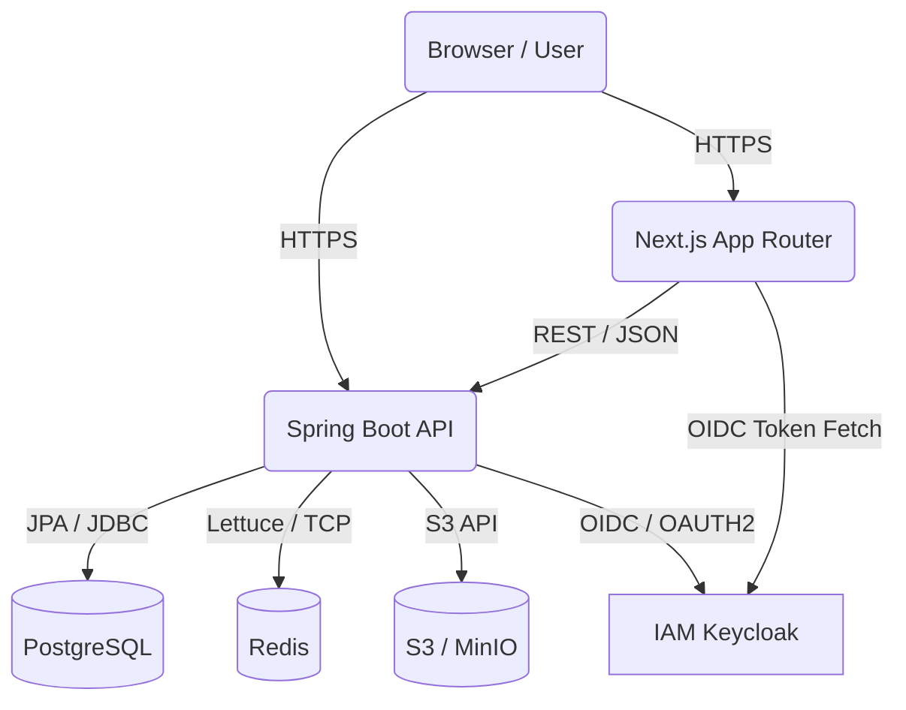

# System Architecture: FuelEU Control Tower

## 1. High-Level Architecture
We pursue a **Modular Monolith** architecture pattern to lower initial complexity while retaining strict, microservice-like boundaries between Bounded Contexts.
The application logic executes synchronously but leverages asynchronous Outbox patterns for background workflows, heavy exports, and notifications.

## 2. Infrastructure Diagram (Local / K8s targets)

## 3. Technology Stack Choice Rationales

### 3.1. Frontend Ecosystem
- **Next.js (App Router):** First-class TypeScript support and structured filesystem routing for a sprawling UI.
- **React Hook Form + Zod:** Complex domain logic forms require stable, predictable client-side validation reflecting backend rules.
- **Tailwind CSS & shadcn/ui:** Facilitates rapid enterprise-grade styling that avoids custom CSS drift over time.
- **TanStack Query / Table:** Enterprise-grade data synchronization and heavy grid manipulation (crucial for ship fleets).

### 3.2. Backend Ecosystem
- **Java 21 + Spring Boot 3:** Strong performance, excellent ecosystem, industry standard for enterprise regulatory systems.
- **Spring Modulith:** Enforces bounded contexts natively. Prevents "spaghetti dependencies" across domain modules (e.g., stopping the Validation subsystem from querying the Security subsystem directly via DB relationships).
- **Spring Data JPA & Flyway:** Predictable, versioned relational state control.

### 3.3. Ancillary Systems
- **PostgreSQL 16:** Core transactional persistence. Relational structure is mandatory for regulatory and financial tracing.
- **Keycloak:** Scalable OIDC implementation. Prepares the platform for smooth transitions to Auth0 or Okta down the road.
- **Redis:** Used exclusively for fast short-lived workflow sessions and caching API thresholds.
- **MinIO / S3:** Object storage decoupled from the database allows infinite scaling of PDF / XML evidence attachments.

## 4. API Core Tenets
- **Contract-First:** `/packages/openapi` dictates the API shape. No API changes occur without an OpenAPI schema modification.
- **REST-first:** Standard, predictable resource routing (`/api/v1/vessels/{id}/years/{year}/borrowing-records`).
- **Idempotency:** Modifying endpoints (`POST / PUT / PATCH`) should employ idempotency keys to handle frontend network retry safety during mass calculation stages.

## 5. Security Architecture
- Sessions are token-based and signed. 
- The React App holds the JWT token and transmits it as a Bearer string exclusively over HTTPS.
- Inputs are validated symmetrically (Zod in UI, Bean Validation / MapStruct in API).
- SQL Injection mitigation enforced by JPA framework constraints.
- Sensitive regulatory records trigger immutable append-only Audit Logs.
