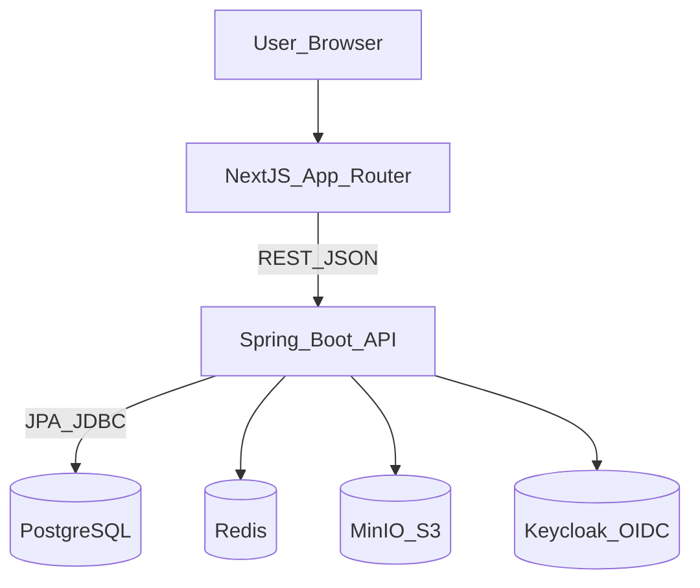

# FuelEU Control Tower (MVP): MBA Capstone Final Report

**Project Title**: FuelEU Control Tower — Pooling, Banking, and Borrowing Platform  
**Version**: v1.0.0-MVP (per `CAPSTONE_PROGRESS.md`)  
**Date**: 2026-03-30  

## Executive Summary
FuelEU Maritime (EU Regulation 2023/1805) introduces binding greenhouse-gas (GHG) intensity limits for energy used on voyages linked to EU ports. Shipping companies that remain on spreadsheet workflows face three compounding risks: (1) calculation errors in legally binding compliance balances, (2) weak audit trails and evidence management, and (3) slow decision cycles that convert manageable deficits into cash penalties and delayed Document of Compliance (DoC) readiness.

The **FuelEU Control Tower** is a full-stack MVP that digitizes the compliance lifecycle into a **deterministic, database-backed, auditable workflow**. It provides: fleet registry, automated import (Excel/XML), executive dashboarding, and flexibility mechanisms (banking, borrowing, pooling) in a single integrated platform.

**Outcome**: A runnable end-to-end demo environment (Next.js + Spring Boot + PostgreSQL), with deterministic imports and recorded flexibility operations, designed to be extended into a production multi-tenant control tower.

## 1. Problem Statement
### 1.1 Why this problem matters
- **Regulatory pressure**: FuelEU introduces performance targets and penalties tied to energy and GHG intensity.
- **Operational complexity**: A fleet has many vessel-year states, each with different scopes, verifications, and deadlines.
- **Financial exposure**: Even small persistent deficits can create significant penalty exposure when aggregated.
- **Audit requirements**: Compliance outcomes must be defensible to verifiers and regulators; spreadsheets are brittle.

### 1.2 Stakeholders
- **Ship Owner / Operator (Compliance team)**: needs accurate balances, decision support for flexibility.
- **Commercial Pooling Manager**: optimizes pooling strategies to minimize penalties.
- **Verifier Liaison / Verifier**: needs explainable calculations and evidence traceability.
- **Executive sponsor**: needs KPI visibility and risk concentration reporting.

## 2. Regulatory Context (FuelEU Maritime)
FuelEU imposes an **applicable GHG intensity limit** per reporting year. The platform models the core compliance balances and the flexibility mechanisms:
- **ICB (Initial Compliance Balance)**: pre-flexibility trajectory distance.
- **ACB (Adjusted Compliance Balance)**: ICB adjusted with carry-forward and bounds.
- **VCB (Verified Compliance Balance)**: final locked and verifier-approved balance.

Key binding constraints implemented/represented (see `Study Material/params.json`):
- **Borrowing cap**: \(2\% \times\) applicable GHG limit \(\times\) in-scope energy.
- **Borrow repayment**: borrowed compliance repaid at \(1.10\times\) next period.
- **No consecutive borrowing**.
- **Pooling constraints**: one pool per ship-year; pool net pre-balance positive; must not worsen deficit.
- **Penalty conversion basis**: VLSFO LCV and penalty rate for deficit-to-euro conversion.

## 3. Solution Overview
### 3.1 What we built (MVP scope)
The MVP is a **FuelEU compliance control tower** with the following modules:
- **Fleet Registry**: create/list vessels, persist to PostgreSQL.
- **Imports**: upload XLSX/XML; parse and execute ingestion pipeline.
- **Compliance & Dashboard**: fleet-level KPIs and high-risk vessel listing.
- **Flexibility**: record banking / borrowing / pooling operations (transaction ledger style).
- **Workflow surfaces** (UI pages): doc-tracker, ledger, settings (foundation for capstone narrative).

### 3.2 Differentiation vs spreadsheet workflows
- **Deterministic persistence**: a single source of truth in PostgreSQL.
- **Separation of concerns**: UI renders values; binding computations live on backend.
- **Auditability-ready design**: domain + DB model designed for traceability.
- **Import automation**: XML ingestion pipeline compatible with structured DNV/THETIS-MRV style exports.

## 4. System Architecture
The platform is implemented as a modular monolith with clear boundaries:

### 4.1 Technology stack
- **Frontend**: Next.js 14 (App Router), TypeScript, Tailwind; KPI charts via Recharts.
- **Backend**: Java 21, Spring Boot, Spring Data JPA, Flyway.
- **Database**: PostgreSQL 16.
- **Infra**: Docker Compose for local environment services.

### 4.2 API contract governance
The repository enforces **contract-first** development:
- Source of truth: `packages/openapi/api-spec.yaml`
- UI calls align with `/api/v1/...` endpoints implemented in Spring controllers.

## 5. Data Model (MVP-relevant)
The MVP schema is delivered via Flyway migrations (`apps/api/src/main/resources/db/migration`), including:
- Registry: `vessel`, `company`, `reporting_period`, `vessel_year`
- Flexibility: `banking_record`, `borrowing_record`, `pool`, `pool_participant`, `pool_allocation`
- Ingestion: `import_batch` (tracking), plus ingestion-related tables as extended

## 6. Methodology & Computation Integrity
### 6.1 Principle: “No UI-side math”
Legal/regulatory computations are backend-owned. The UI displays results from API payloads and does not compute binding balances in `onChange` handlers.

### 6.2 Parameterization & rule versioning
Regulatory parameters (GHG limits, caps, multipliers, penalty rates) are externalized in `Study Material/params.json` and designed to map into DB-backed rule records per reporting period.

### 6.3 Ingestion methodology (XML → compliance engine)
The ingestion pipeline parses structured XML nodes, extracts vessel IMO and energy/emissions fields, applies unit conversions, and hydrates compliance calculations. Where the vessel is not present in the registry, ingestion warns and skips persistence—ensuring deterministic database integrity.

## 7. Business Value / ROI Narrative (MBA framing)
### 7.1 Value drivers
- **Penalty avoidance**: earlier identification of deficits + ability to execute flexibility mechanisms reduces expected cash penalties.
- **Faster decisions**: pooling and borrowing constraints are surfaced as guardrails, reducing rework and audit disputes.
- **Audit cost reduction**: standardized data and evidence storage reduces verification friction and repeat queries.

### 7.2 ROI model (template for submission)
Define ROI at fleet level:
- **Baseline expected penalty** (spreadsheet workflow) vs **optimized penalty** (control tower workflow)
- Add operational savings (time saved per vessel-year, reduced manual reconciliations)
- Factor implementation and operating costs (hosting + maintenance)

## 8. Risks, Limitations, and Controls
- **Security**: MVP uses permissive dev security to enable demos; production requires OIDC enforcement and RBAC.
- **Data completeness**: ingestion depends on quality and consistency of input exports.
- **Regulatory changes**: must support parameter versioning by reporting period.
- **Operational misuse**: flexibility operations must create correlated audit events (required for production hardening).

## 9. Roadmap (post-MVP)
- Full RBAC integration with Keycloak (tenant-scoped data access).
- Implement complete audit-event correlation for every flexibility action.
- Expand OpenAPI models and generate typed client SDK for Next.js.
- Add scenario engine and BI export layer for Power BI/Tableau-ready datasets.

## Appendix A: Demo Runbook (deterministic path)
### A1. Local ports
- Web: `http://localhost:3000`
- API: `http://localhost:8082`
- Postgres: `localhost:5438`
- Keycloak: `http://localhost:8081`
- MinIO: `http://localhost:9001`

### A2. Demo sequence (5–8 minutes)
1. Start infrastructure via Docker Compose.
2. Start backend API (Spring Boot) and confirm `/actuator` returns 200.
3. Start frontend and open dashboard.
4. Upload `Study Material/9231614_PortPart1-DNV.xml` and show successful pipeline response.
5. Register a demo vessel (IMO from XML) in Fleet Registry.
6. Execute a pooling action for that vessel (Flexibility Workspace).
7. Refresh dashboard/fleet pages to demonstrate persistence-backed results.

